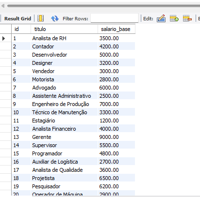
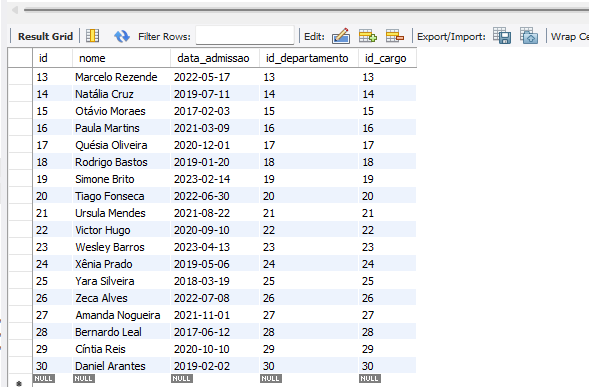
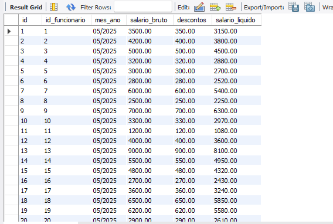

# 📊 Projeto de Banco de Dados - Recursos Humanos (RH)

Este projeto consiste na modelagem e implementação de um banco de dados para um sistema de Recursos Humanos, desenvolvido tanto para **MySQL** quanto para **Oracle**. Ele inclui tabelas de departamentos, cargos, funcionários, dependentes e folhas de pagamento, com aproximadamente **30 registros em cada tabela**.

---

## 📌 Estrutura do Projeto

### Tabelas criadas:

- `departamento`
- `cargo`
- `funcionario`
- `dependente`
- `folha_pagamento`

---

## 🛠️ Tecnologias Utilizadas

| Banco de Dados | Ferramenta de Gerenciamento |
|----------------|-----------------------------|
| MySQL          | MySQL Workbench             |
| Oracle         | Oracle SQL Developer        |

---

## ✅ Objetivos

- Criar e popular um banco de dados com informações de funcionários.
- Testar integridade relacional e regras de negócio.
- Usar linguagem SQL para manipulação, consulta e análise de dados.

---

## 🗃️ Scripts Utilizados

### 📌 MySQL

- Script de criação de tabelas com `AUTO_INCREMENT`.
- Inserção de 30 registros por tabela.
- Utilização de `DATE`, `DECIMAL`, `VARCHAR`, `FOREIGN KEY`.

📁 Arquivo: `script_mysql.sql`  
📁 Arquivo de inserts: `script_inserts.sql`

📸 **Prints de telas (MySQL Workbench):**

- Tabela `departamento`:  
  

- Tabela `cargo`:  
  

- Tabela `funcionario`:  
  

- Tabela `dependente`:  
  

- Tabela `folha_pagamento`:  
  

---

### 📌 Oracle

- Script adaptado para Oracle com `IDENTITY` (Oracle 12c+).
- Uso de `VARCHAR2`, `NUMBER`, `TO_DATE`.
- Inserção dos mesmos 30 registros.

📁 Arquivo: `script_oracle.sql`  
📁 Arquivo de inserts: `script_inserts.sql` (adaptável para Oracle)

---

## 📈 Exemplos de Insert SQL

```sql
-
-- Inserções para tabela departamento
INSERT INTO departamento (nome) VALUES
('Recursos Humanos'), ('Financeiro'), ('TI'), ('Marketing'), ('Logística');

-- Inserções para tabela cargo
INSERT INTO cargo (titulo, salario_base) VALUES
('Analista RH', 3500.00), ('Desenvolvedor', 5000.00), ('Contador', 4000.00),
('Designer', 3800.00), ('Supervisor', 4500.00), ('Gerente', 7000.00);

-- Inserções para tabela funcionario
INSERT INTO funcionario (nome, data_admissao, id_departamento, id_cargo) VALUES
('Ana Souza', '2022-01-15', 1, 1),
('Carlos Lima', '2021-03-22', 2, 3),
('Bruna Silva', '2023-07-10', 3, 2),
('Eduardo Costa', '2020-09-18', 4, 4),
('Fernanda Rocha', '2019-11-05', 5, 5),
('Lucas Martins', '2018-06-01', 1, 6),
('Paulo Alves', '2022-02-10', 2, 3),
('Marina Duarte', '2023-01-20', 3, 2),
('Ricardo Nunes', '2020-12-30', 4, 4),
('Juliana Teixeira', '2021-08-12', 5, 1);

-- Inserções para tabela dependente
INSERT INTO dependente (nome, parentesco, id_funcionario) VALUES
('João Souza', 'Filho', 1),
('Clara Lima', 'Esposa', 2),
('Lucas Silva', 'Filho', 3),
('Beatriz Costa', 'Filha', 4),
('Daniel Rocha', 'Cônjuge', 5),
('Rafaela Martins', 'Filha', 6),
('Gustavo Alves', 'Filho', 7),
('Marta Duarte', 'Mãe', 8),
('Thiago Nunes', 'Filho', 9),
('Helena Teixeira', 'Esposa', 10);

-- Inserções para tabela folha_pagamento
INSERT INTO folha_pagamento (id_funcionario, mes_ano, salario_bruto, descontos, salario_liquido) VALUES
(1, '05/2025', 3500.00, 350.00, 3150.00),
(2, '05/2025', 4000.00, 400.00, 3600.00),
(3, '05/2025', 5000.00, 500.00, 4500.00),
(4, '05/2025', 3800.00, 380.00, 3420.00),
(5, '05/2025', 4500.00, 450.00, 4050.00),
(6, '05/2025', 7000.00, 700.00, 6300.00),
(7, '05/2025', 4000.00, 400.00, 3600.00),
(8, '05/2025', 5000.00, 500.00, 4500.00),
(9, '05/2025', 3800.00, 380.00, 3420.00),
(10, '05/2025', 3500.00, 350.00, 3150.00);

```
---
## 📄 Licença

Este projeto está licenciado sob a **Licença MIT** — veja o arquivo [LICENSE](LICENSE) para mais informações.

---
**## 🧑‍💻 Autor

**Tiago Fonseca** 
